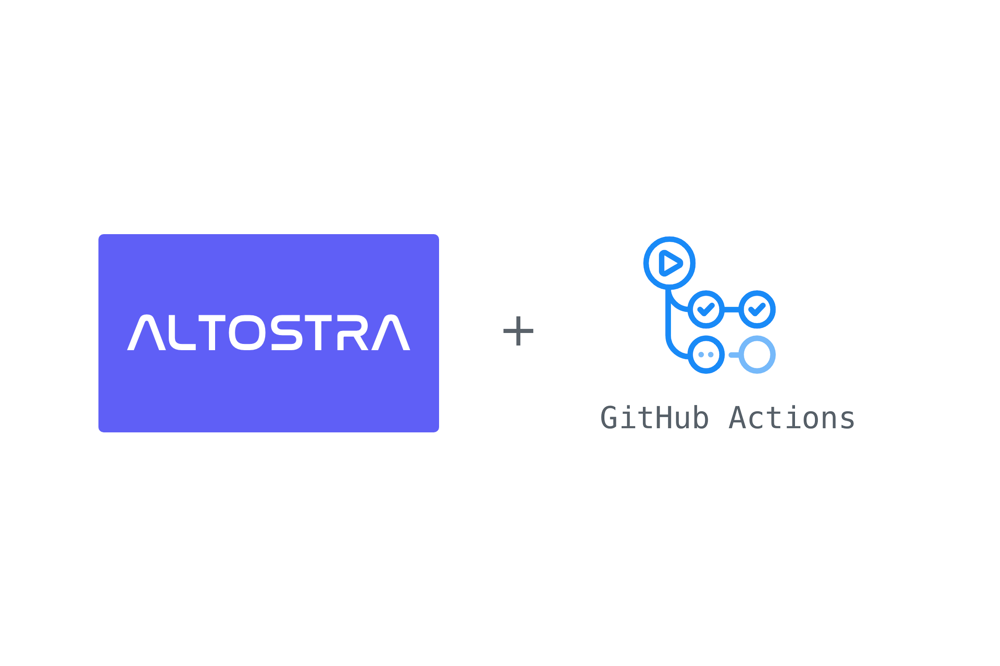

## About

GitHub Action to login against an Altostra account.

**See also**
* [push-deploy-action](https://github.com/altostra/push-deploy-action)

## Usage

### Inputs
Following inputs can be used as step.with keys

| Name  | Type  | Required | Description  |
|:-:|:-:|:-:|:-:|
| api-token  | string  |  Yes |  Your Altostra API token from [Altostra settings](https://app.altostra.com/settings/tokens). |

## Example usage
```yaml
on: [push]

jobs:
  hello_world_job:
    runs-on: ubuntu-latest
    name: A basic Altostra job
    steps:
    - uses: actions/checkout@v2
    - id: Login
      uses: altostra/altostra-login-action@v1
      with:
        api-token: "${{ secrets.ALTO_API_TOKEN }}"
```